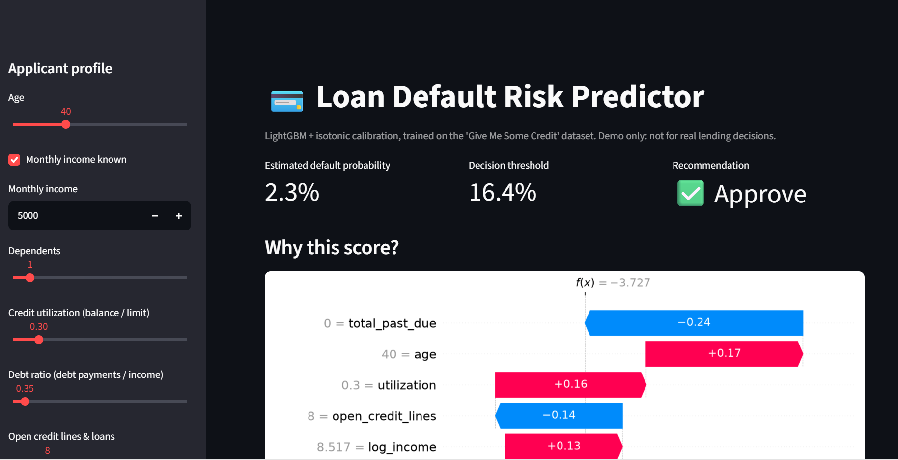
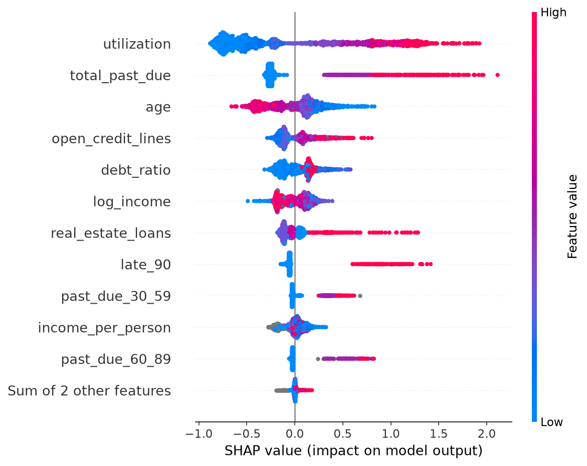

# 💳 Loan Risk Predictor Application

End-to-end tabular ML project: messy credit data → calibrated default-probability
model → explainable predictions in a deployed web app.

Application Link:-https://your-loan-predictor-13.streamlit.app



## Problem
Given an applicant's credit profile, estimate the probability they will become
seriously delinquent (90+ days) within two years, and recommend approve / review.
Only ~7% of applicants default, so accuracy is meaningless; the project is built around
ranking quality, probability quality, and decision cost.

## Approach
| Step | What I did | Why |
|---|---|---|
| Cleaning | Treated `96`/`98` in past-due columns as placeholder codes → NaN; removed age < 18 | These are data-entry codes, not real counts |
| Features | Missing-income flag, log income, income per household member, total past-due, clipped ratios | Missingness is informative; ratios have extreme outliers |
| Baseline | Logistic regression (median impute + scale) | Gives a benchmark the GBM must beat |
| Model | LightGBM, 5-fold stratified CV, optional Optuna tuning | Handles NaNs and non-linearity natively |
| Calibration | Isotonic regression on a separate calibration split | Scores can be read as true probabilities |
| Decision rule | Threshold minimising expected cost (missed default = 5× a wrongly rejected applicant) | Ties the model to a business objective |
| Explainability | SHAP global summary + per-applicant waterfall | Lending decisions need to be justified |

Data split: 70% train / 15% calibration + threshold / 15% untouched test.

## Results (held-out test set)
_Fill in from `reports/metrics.json` after training._

| Model | ROC-AUC | PR-AUC | Brier |
|---|---|---|---|
| Logistic regression | 0.8534595970407737 |0.3770756617175405 |0.3770756617175405 |  0.14417862798116465| LightGBM (calibrated) |0.8653604992642976 |0.3927705428918554 | 0.048747469554108705 |

Decision at the cost-optimal threshold: precision 36.8%  , recall 57.2%, expected cost per applicant 0.209 (vs  0.334 for approving everyone).

<p float="left">
  
  
</p>



## Run it
```bash
pip install -r requirements.txt
# download cs-training.csv from https://www.kaggle.com/c/GiveMeSomeCredit/data into data/
python src/train.py --data data/cs-training.csv --tune 30
streamlit run app.py
```

## Limitations & next steps
- Dataset is from 2011 and has no protected-attribute labels, so I haven't audited fairness. A real system would need to.
- The 5:1 cost ratio is an assumption; the threshold moves with it (`--cost-fn`, `--cost-fp`).
- No temporal split because the data has no dates; production would validate out-of-time.
- Next: monitoring for drift, and a larger dataset (Home Credit) with relational features.

## Project structure
```
app.py            Streamlit demo
src/features.py   Cleaning + feature engineering (shared by train and app)
src/train.py      CV, tuning, calibration, threshold, evaluation, plots
models/           Saved model artifact
reports/          Metrics and figures used in this README
```
